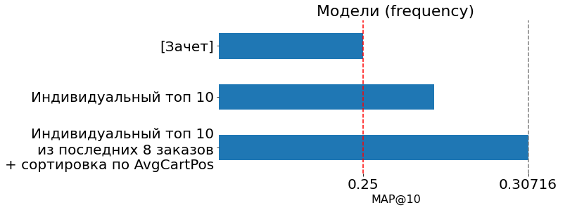
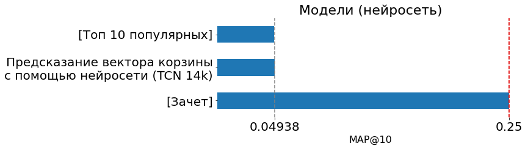
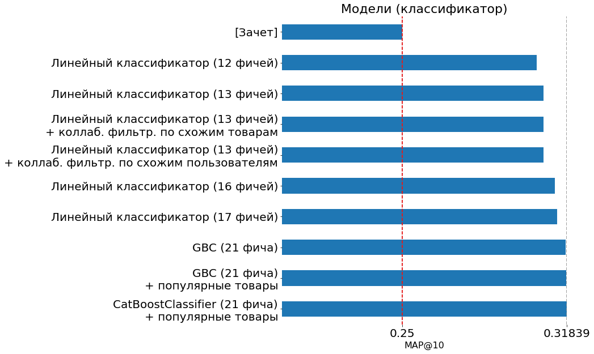
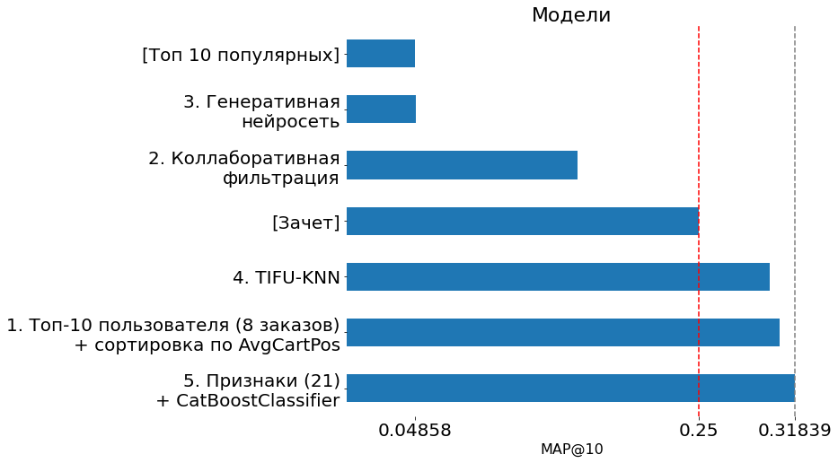

# Рекомендательная система для онлайн-гипермаркета Instacart

*Дипломная работа*

## Ссылки

1. https://github.com/d-01/instacartlib
   * Разработанная согласно заданию, программная библиотека
1. https://colab.research.google.com/drive/1aFc-e_u5W-BrA7cdp6E2qZsgZtiJCGC8?usp=sharing
   * Демо в Google Colab
1. https://github.com/d-01/graduate-2022-rec-sys/blob/main/submission.csv
   * Файл для оценки модели на платформе kaggle
   * Private / public score: 0.31839 / 0.32082

## Описание задачи

### Техническое задание

1. Алгоритм предсказания покупок пользователя:
   1. Точность по метрике MAP@10 > 0.25
   1. Время обучения: не более 5 часов.
   1. Прогнозирование на всех покупателей: не более 15 минут.
1. Программная библиотека со следующими функциями:
   1. Выдать K релевантных товаров по ID одного или нескольких пользователей.
   1. Добавить новые данные о транзакциях и о товарах.
   1. Обучить рекомендательную систему заново.


### Описание датасета

Датасет состоит из 2 файлов:

* **transactions.csv** (26M, 9) - транзакции покупателей
* **products.csv** (50k, 6) - товары, отделы, категории

#### transactions.csv


* **order_id** - уникальный идентификатор заказа
* **user_id** - уникальный идентификатор пользователя (100 000)
* **order_number** - порядковый номер заказа в истории покупок пользователя (1-99)
* **order_dow** - день недели формирования заказа (0-6)
* **order_hour_of_day** - час дня формирования заказа (0-23)
* **days_since_prior_order** - число дней с совершения предыдущего заказа данным пользователем
* **product_id** - уникальный идентификатор товара (49 465)
* **add_to_cart_order** - порядковый номер товара при добавлении в корзину
* **reordered** - был ли товар "перезаказан"

#### products.csv


* **product_id** - уникальный идентификатор товара
* **product_name** - название товара
* **aisle_id** - уникальный идентификатор категории (134)
* **department_id** - уникальный идентификатор отдела (21)
* **aisle** - название категории
* **department** - название отдела

### Задача предсказания целевой корзины

*Next Basket Prediction / Предсказание целевой корзины*

*Next Basket* -- целевая корзина, следующая после последней:

```
User orders:
1 | 32792 47766 20574 12000 48110 22474 16589 35917 27344 30489 27966 13176
2 | 16797 47526  8479 47766 19051  8138
3 | 47766 32792 20574  7781 28874
4 | 49451 32792 32139 34688 36735 37646 22829 24852 47209 33276 45613  9681
n |     ?     ?     ?     ?     ?     ?     ?     ?     ?     ?
```

### Метрика Mean Average Precision

*Mean Average Precision at 10 / MAP@10*

Если обычная точность (precision) оценивает все релевантные элементы равноценно, то AP@K снижает оценку если релевантный элемент, стоит в списке ниже нерелевантного.


От чего зависит оценка (score) по метрике MAP@K:

1. Чем больше релевантных элементов (верных предсказаний), тем выше оценка.
1. Любой релевантный элемент, должен быть выше любого нерелевантного, нарушение этого порядка дополнительно снижает оценку.
1. Повторяющиеся релевантные элементы учитываются как нерелевантные, т.е. снижают оценку.

От чего *не* зависит оценка:

1. Если поменять местами два релевантных или два нерелевантных элемента оценка не изменится.
1. Предсказания ниже первых k, не учитываются.

## Поиск модели

### Протестированные модели и оценки на kaggle

1. Генеративная нейросеть
   * Предсказание вектора заказа с помощью нейросети (TCN 14k).
1. Коллаборативная фильтрация
   * SVD, 100 (implicit), последние 10 заказов, только из купленных ранее.
1. TIFU-KNN
   * Предсказание с помощью модели TIFU-KNN (k=300, a=0.9): 90% индивидуальный компонент + 10% коллаборативный компонент.
1. Индивидуальный топ 10 из последних 8 заказов + сортировка по AvgCartPos
   * Частотная модель + сортировка.
1. CatBoostClassifier (21 признак / фича) + популярные товары
   * Задача бинарной классификации. Целевой признак -- товар будет перезаказан пользователем: 1 - да, 0 - нет.

#### Все эксперименты и kaggle private score

| МЕТОД                                                        | MAP@10      |
| ------------------------------------------------------------ | ----------- |
| **Топ 10 популярных**                                        | **0.04858** |
| Предсказание вектора корзины с помощью нейросети (TCN 14k)   | 0.04938     |
| SVD, 128 (surpriselib)                                       | 0.08375     |
| SVD, 100 (implicit)                                          | 0.12076     |
| SVD, 100 (implicit), последние 10 заказов                    | 0.13518     |
| SVD, 100 (implicit), только из купленных ранее               | 0.14569     |
| SVD, 100 (implicit), последние 10 заказов, только из купленных ранее | 0.16385     |
| **Зачет**                                                    | **0.25000** |
| Индивидуальный топ 10 из последних 10 заказов + SVD для сортировки | 0.25777     |
| Индивидуальный топ 10                                        | 0.27455     |
| Индивидуальный топ 10 из последних 5 заказов                 | 0.29526     |
| Предсказание с помощью TIFU-KNN (a=1.0)                      | 0.29716     |
| Предсказание с помощью TIFU-KNN (k=300, a=0.9)               | 0.30036     |
| Индивидуальный топ 10 из последних 11 заказов                | 0.30108     |
| Индивидуальный топ 10 из последних 10 заказов                | 0.30199     |
| Индивидуальный топ 10 из последних 9 заказов                 | 0.30275     |
| Индивидуальный топ 10 из последних 7 заказов                 | 0.30291     |
| Индивидуальный топ 10 из последних 8 заказов                 | 0.30326     |
| Индивидуальный топ 10 из последних 10 заказов + сортировка по AvgCartPos | 0.30381     |
| Линейный классификатор (12 фичей)                            | 0.30572     |
| Индивидуальный топ 10 из последних 8 заказов + сортировка по AvgCartPos | **0.30716** |
| Линейный классификатор (13 фичей)                            | 0.30856     |
| Линейный классификатор (13 фичей) + коллаб. фильтр. по схожим товарам | 0.30868     |
| Линейный классификатор (13 фичей) + коллаб. фильтр. по схожим пользователям | 0.30876     |
| Линейный классификатор (16 фичей)                            | 0.31347     |
| Линейный классификатор (17 фичей)                            | 0.31431     |
| GBC (21 фича)                                                | 0.31785     |
| GBC (21 фича) + популярные товары                            | 0.31803     |
| CatBoostClassifier (21 фича) + популярные товары             | **0.31839** |

В следующих разделах приведено описание каждой из 5-и моделей.

### Индивидуальный топ-10

Простая частотная модель основанная на подсчете покупок каждого товара индивидуально для каждого пользователя.


1. Для каждого пользователя:
   1. Считаем частоту покупок каждого товара.
   1. Сортируем купленные товары по частоте и используем топ-10 в качестве предсказаний.

Улучшения:

1. Используем не более 8 последних заказов каждого пользователя.
1. Дополнительно сортируем товары по средней позиции в корзине пользователя (AvgCartPos).

#### Результаты



### Предсказание вектора корзины с помощью нейросети

> Участник, занявший 3е место в соревновании *Instacart Market Basket Analysis*, использовал чисто нейросетевой подход (без фичей, созданных вручную / hand-crafted features) [[подробнее](https://github.com/sjvasquez/instacart-basket-prediction)].
>
> Второе место занял участник использовав hand-crafted фичи [[подробнее](https://github.com/KazukiOnodera/Instacart)].

История пользователя состоит из последовательности заказов. Каждый заказ (корзина) представляется m-hot вектором из 0 и 1. Длина вектора равна числу всех возможных товаров.

Тогда задача сводится к NLP задаче генерации последовательности:

* Слово (embedding) = корзина (m-hot вектор)
* Предложение (sequence) = история заказов (history)

Обучающий датасет: `n - 1` заказ (кроме последнего), последний заказ используется как метка.


Тестовый датасет: `n - 1` заказ (включая последний), предсказывается следующий (целевой).


Архитектура нейросети: *Temporal Convolutional Network* (TCN, Bai et al., 2018).


#### Результаты



#### Выводы

1. Нейросеть работает лучше случайной модели, но точность равносильна примитивной модели, усредняющей входные вектора.
1. Недостаточный размер нейросети для данный задачи.
   * Стоило увеличить число параметров до 14M (увеличить в 1000 раз, 14k * 1000 = 14M).
1. Проблемы совместимости нестандартных тензоров (sparse / ragged) и некоторых слоев (Conv1D) в Keras.
1. Трудности при выборе функции потерь для задачи *multilabel classification*:
   * Классификация на бесконечное число классов.
   * Низкая эффективность обучения, низкая точность.

### Коллаборативная фильтрация

Long format (26M rows):


Wide format (sparse, 5000M):


SVD разложение:


#### Результаты


#### Выводы

1. Область применения коллаборативной фильтрации:
   1. Однократные покупки.
   1. Холодный старт.
   1. Рекомендации новых товаров.
   1. Поиск похожих товаров.
   1. Поиск похожих пользователей.
1. Не подходит для периодических покупок, уступает простой частотной модели.

### TIFU-KNN

*Temporal-Item-Frequency-Based User-KNN* (TIFU-KNN) -- метод основанный на векторном представлении истории пользователя (PIF) и использовании этого вектора для поиска ближайших соседей (User-KNN).

Способ описанный в научной статье от 31 мая 2020 года (https://arxiv.org/abs/2006.00556):


*Рекомендации Основанные на Персонализированной Частотности Товаров*

*Personalized Item Frequency* (PIF) -- векторное представление истории покупок пользователя. Длина вектора равна количеству всевозможных товаров.

Анализ датасета Instacart:

* В среднем 3 из 10 товаров в корзине пользователя заказаны впервые.
* 3 из 4 товаров можно найти в заказах похожих пользователей.
* 11% товаров в корзине не предсказуемы этой моделью, т.к. ни сам пользователь ни похожие пользователи ранее не покупали этот товар.

#### PIF

*PIF / Personalized Item Frequency*

Векторное представление истории покупок пользователя или, просто, *вектор пользователя*.


Иерархический затухающий коэффициент используется для взвешенной суммы векторов корзин.

##### Роль затухающего коэффициента

Без затухания:

```
order | 0    1    2    3    4    5    6    7    8    9   | sum
----- | ------------------------------------------------ | ---
prod1 | 1.0  1.0  1.0  1.0  1.0  0.0  0.0  0.0  0.0  0.0 | 5.0
prod2 | 0.0  0.0  0.0  0.0  0.0  1.0  1.0  1.0  1.0  1.0 | 5.0
```

С затуханием:

```
order | 0    1    2    3    4    5    6    7    8    9   | sum
----- | ------------------------------------------------ | ---
prod1 | 0.1  0.2  0.3  0.4  0.5  0.0  0.0  0.0  0.0  0.0 | 1.5
prod2 | 0.0  0.0  0.0  0.0  0.0  0.6  0.7  0.8  0.9  1.0 | 4.0
```

#### Предсказание

$$
P = \alpha \cdot u_t + (1-\alpha) \cdot u_n
$$

Предсказание состоит из двух компонентов:

1. **Индивидуальный компонент** (repeated purchase component) представлен как вектор пользователя $u_t$ (PIF).
1. **Коллаборативный компонент** представлен как усредненный PIF вектор похожих пользователей (ближайших соседей): $u_n = \text{avg}(U_{neighbor})$, где $U_{neighbor}$ вектора ближайших $k$ соседей ($k=300$).

#### Результаты


1. При $\alpha=1.0$, 100% информации берется из истории пользователя.
1. При $\alpha=0.9$, 90% информации берется из истории пользователя, а 10% из истории 300 похожих пользователей.

#### Выводы

1. 70% товаров пользователь заказывал ранее.
1. До 20% товаров, заказанных пользователем впервые, можно найти в истории похожих пользователей.
1. 10% товаров, заказанных впервые, не встречаются в истории пользователя, ни похожих пользователей.
1. Затухающий коэффициент дает прирост в оценке. При $\alpha=1.0$ без затухающего коэффициента модель равносильна простой частотной модели:
   1. Без коэффициента затухания: 0.27455
   1. С коэффициентом затухания: 0.29716

### Классификатор

Задача сводится к задаче бинарной классификации: для каждой пары пользователь-товар (user-item) модель предсказывает значение `1`, если товар будет перезаказан (есть в целевой корзине), `0` если нет.

Для этого необходимо сформировать два датасета: *тренировочный* для обучения классификатора и *тестовый*, на котором выполняется предсказание целевой корзины.

#### Тренировочный датасет


* В тренировочном датасете используются 5 предпоследних заказов, а последний в качестве целевого.

На основании таблицы транзакций рассчитываются признаки (features / фичи). Целевой признак: `in_target` = 1 если товар есть в целевой корзине, 0 если нет.

#### Тестовый датасет


* В *тестовом* датасете используются 5 последних заказов, а целевой предсказывается с помощью обученной модели классификатора.

Для каждой пары пользователь-товар выходной вектор содержит значение в интервале [0, 1] выражающее *вероятность* перезаказа товара Б пользователем А. Для финального предсказания товары сортируются по убыванию вероятности.

#### Feature engineering

*Конструирование фичей*

В противоположность нейросетевому подходу, где фичи формируются нейросетью, в данном методе фичи создаются специалистом вручную. Конструирование оптимальных фичей требует экспертных знаний в данной прикладной (domain) области (розничная торговля, периодические покупки) и глубокого понимания датасета.

Признаки 3-х типов:

1. Признаки пользователя (`u_` user):
   * Например: число транзакций, число уникальных товаров в истории, число заказов, средний размер заказа, среднее время между заказами и т.д.
1. Признаки товара (`i_` item):
   * Например: сколько пользователей купили этот товар, сколько раз в среднем пользователь покупает этот товар, среднее время между заказами этого товара и т.д.
1. Признаки взаимодействия пользователя с конкретным товаром (`ui_` user-item):
   * Например: сколько раз пользователь купил определенный товар, дней с момента последнего заказа этого товара, средняя позиция товара в корзине и т.д.


* `i_days_delay_global_mid` -- средний интервал между заказами товара Б среди всех пользователей;
  * Как часто пользователи в среднем перезаказывают товар Б.

* `ui_total_buy_ratio` -- доля заказов пользователя А в которых есть товар Б;
  * = 1.0 если товар Б есть в 10 из 10 заказов пользователя А.
  * = 0.2 если товар Б есть в 2 из 10 заказов пользователя А.

* `u_n_transactions` -- число транзакций пользователя А;
  * Отражает активность пользователя.
* `u_unique_items` -- число уникальных товаров в истории покупок пользователя А;
  * Отражает его склонность пробовать новые товары.
* `ui_total_buy` -- число заказов пользователя А в которых есть товар Б;
* `ui_readyness_mid_abs` -- отклонение пользователя А от привычного интервала перезаказа товара Б.

Показатель `readyness` (готовность):

* Например в среднем между заказами товара Б проходит 10 дней, т.е. `ui_days_delay_mid` = 10.
* Последний раз пользователь купил товар Б 12 дней назад, т.е. `ui_days_passed` = 12.
* Тогда `ui_readyness_mid = (ui_days_passed - ui_days_delay_mid)` = 2
  * Отрицательные значения = с последнего заказа прошло слишком мало времени, пользователь не готов купить товар.
  * Большое значение = прошло больше времени чем обычно, пользователь готов купить товар.

#### Результаты



#### Выводы

1. На точность предсказаний влияет качество и количество фичей.
1. Точность этого способа превосходит простую частотную модель, т.к. позволяет задействовать дополнительную информацию, например об интервале между заказами, времени суток и дне недели.

### Итоги



1. Одни и те же методы не подходят для разных типов товаров:

   1. Фильмы, музыка, книжный магазин.

      * Однократные покупки
      * Задача: коллаборативная фильтрация
      * Рекомендации на основе похожих пользователей или товаров.

   1. Гипермаркеты (еда, продовольственные товары).

      * Периодические покупки

      * Задача: генерация следующего набора элементов (NBR / NBP / Sets2sets).
      * Простые модели: подсчет покупок, средний интервал между заказами.

   1. Техника, услуги, одежда.

      * Смешанные покупки: однократные + периодические

      * Задача: генерация следующего элемента последовательности (Seq2seq).

2. Коллаборативная фильтрация подходит для рекомендаций (фильмы, однократные покупки, холодный старт), но не подходит для *предсказания* периодических покупок.

## Библиотека `instacartlib`

* https://github.com/d-01/instacartlib
* Демо в [Google Colab](https://colab.research.google.com/drive/1aFc-e_u5W-BrA7cdp6E2qZsgZtiJCGC8?usp=sharing)

Установка:

```
pip install https://github.com/d-01/instacartlib/archive/main.zip
```

Загрузка датасета:

```python
from instacartlib import InstacartDataset

InstacartDataset(verbose=1).download(to_dir='instacart_data')
```

Инициализация API и загрузка предобученной модели:

```python
from instacartlib import NextBasketPrediction

nbp = NextBasketPrediction(verbose=1)
nbp.add_data('instacart_data')
nbp.load_model('catboost')  # or 'gbc'
```

Получить предсказания / рекомендации для указанных пользователей:

```python
nbp.get_predictions(user_ids=[20001, 85768])
```


```python
nbp.predictions_to_csv('submission.csv')
```

submission.csv:

```
user_id,product_id
1,196 12427 25133 10258 46149 39657 38928 35951 13032 49235
2,47209 19156 1559 18523 33754 16589 21709 24852 39928 22825
3,39190 47766 43961 21903 17668 18599 16797 48523 32402 22035
...
```

Обучение новой модели:

```python
nbp_new = NextBasketPrediction(verbose=1)
nbp_new.add_data('instacart_data')
nbp_new.train_model()
nbp_new.save_model('model_nbp.dump')
```

Время обучения модели (Google Colab):

* ≈25 мин. (GBC)
* ≈17 мин. (CatBoost)
* ≈1 мин. (CatBoost, GPU)

Время генерации предсказаний: ≈2 мин.

