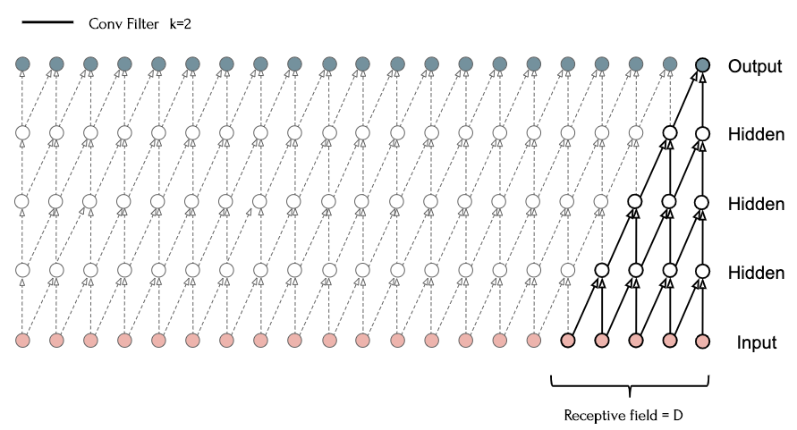

# Temporal Convolutional Networks

## Ссылки

*TCN*

1. https://arxiv.org/abs/1803.01271

   Bai et al., 2018

   *An Empirical Evaluation of Generic Convolutional and Recurrent Networks for Sequence Modeling*

   Proposal of Temporal Convolutional Network (TCN) architecture and comparison to RNNs.

1. https://lukeguerdan.com/blog/2019/intro-to-tcns/

   *Diving Into Temporal Convolutional Networks*

   Некоторые иллюстрации отсюда.

1. https://unit8.com/resources/temporal-convolutional-networks-and-forecasting/

   *Temporal Convolutional Networks and Forecasting*

   Темы: *exponential dilation rate*, формулы расчета *receptive field*, устройство *residual block*, normalization, activation functions.

## Теория

### Dilated convolution

Свертка:

 

1. Слева: одномерная свертка (`Conv1D`), kernel size = 3
1. Справа: двумерная свертка (`Conv2D`), kernel size = (3, 3)

Многослойная сверточная сеть:



*[Source](https://raw.githubusercontent.com/maziarraissi/Applied-Deep-Learning/main/05 - Speech %26 Music/02 - Synthesis.pdf) (page 4)*

Дилатационная (aka перфорированная, aka разряженная) свертка:


*Слева: `Conv1D` -- одномерная свертка; справа: `Conv2D` -- двумерная свертка*

1. Слева: одномерная свертка (`Conv1D`), kernel size = 3, dilation rate = 2
1. Справа: двумерная свертка (`Conv2D`), kernel size = (3, 3), dilation rate = (2, 2)
1. `dilation_rate=1` равносилен обычной свертке.

Temporal Convolution Network:


1. С помощью правильно подобранных значений `dilation_rate` (d) для каждого уровня, можно увеличить рецептивное поле таким образом, чтобы оно полностью покрывало входную последовательность (без пробелов).
1. Последний элемент выходной последовательности будет являться векторным представлением входной последовательности (аналог $h$ -- hidden state в RNN).
1. Размер рецептивного поля подбирается т.о. чтобы покрыть самую длинную входную последовательность.

### Exponential dilation rate

Рассмотрим два примера.

Первый пример (kernel size = 3):


1. `d` -- это dilation rate, значение дилатации для операции свертки:
   * `d=1` берется каждый элемент без пропусков
   * `d=2` берется каждый второй элемент (1 пропускается)
   * `d=4` берется каждый четвертый элемент (3 пропускается)
1. Восклицательными знаками отмечены элементы которые фигурируют в нескольких свертках, т.е. учитываются несколько раз -- **перекрытия**.

Второй пример (kernel size = 2):


1. В этом примере противоположная проблема: элементы входной последовательности, отмеченные красным, вообще не участвуют в операции -- **пропуски**.

Полное покрытие без перекрытия и пропусков, для k=2:


И для k=3:


Чтобы получить полное покрытие необходимо чтобы:

1. Значения d (dilation rate) должны увеличиваться с ростом номера слоя в геометрической прогрессии.
1. Знаменатель (dilation base) геометрической прогрессии должен быть равным размеру ядра свертки, т.е. kernel size = dilation base.

> Ряд чисел $a_1, a_2, ..., a_n$, где $a_n = a_{n-1} \cdot q$, называется *геометрической прогрессией* со знаменателем (base) $q$.
>
> Формула суммы геометрической прогрессии длины $n$:
> $$
> s_n = {a_1 (q^n - 1) \over q - 1}
> $$

Например для k=2, значения дилатации начиная с первого скрытого слоя: 1, 2, 4, 8, 16, ... (или 2<sup>0</sup>, 2<sup>1</sup>, 2<sup>2</sup>, 2<sup>3</sup>, 2<sup>4</sup>, ...), геометрическая прогрессия с параметрами $a_1=1, q=2$.

Для k=3: 1, 3, 9, 27, 81, ... (или 3<sup>0</sup>, 3<sup>1</sup>, 3<sup>2</sup>, 3<sup>3</sup>, 3<sup>4</sup>, ...), геометрическая прогрессия $a_1=1, q=3$.

### Теоретический размер рецептивного поля

> *Замечание.* Далее приведет теоретический размер рецептивного поля. На практике используются residual блоки, включающие несколько Conv1D слоев, поэтому формула для расчета, используемая на практике будет отличаться.

Размер рецептивного поля при условии, что kernel size = dilation base:
$$
r = k^n
$$
где

$r$, receptive field size, размер рецептивного поля;

$k$, kernel size, размер ядра свертки;

$n$, number of layers (including output layer), число слоев или глубина сети.

### Расчет глубины сети

Число слоев, необходимое для полного покрытия входной последовательности длины $l$ при заданном размере ядра свертки $k$:
$$
n = \lceil \log_k l \rceil
$$
где

$\lceil ... \rceil$, ceil, округление вверх;

$l$, length, длина входной последовательности.

Например:

Тренировочный датасет состоит из последовательностей разной длины. Необходимо рассчитать глубину темпоральной сверточной сети с ядром свертки 2, 3 и 5.

Во первых необходимо определить длину в самой большой последовательности, например это 100 элементов, тогда:

* Для k=2: глубина сети n=7
  * `math.log(100, 2) = 6.644`
  * Проверка: при n=7, размер рецептивного поля будет равен 2<sup>7</sup>=128, достаточно чтобы покрыть входную последовательность из 100 элементов.
* Для k=3: n=5
  * Размер рецептивного поля 3<sup>5</sup>=243
* Для k=5: n=3
  * Размер рецептивного поля 5<sup>3</sup>=125

### Padding


1. `padding=valid` -- обычная свертка без использования паддинга естественным образом уменьшает размер входной последовательности.
1. `padding=same` -- ко входной последовательности поровну слева и справа добавляется паддинг, т.о. чтобы размер выхода был равен размеру входа.
1. `padding=causal` -- как и `same`, но весь паддинг добавляется слева.

*Временные ряды (time-series)* -- это последовательности для которых важен порядок следования элементов, каждый последующий элемент может зависеть только от предыдущих.

При предсказании продолжения временного ряда модель должна "видеть" только предыдущие элементы ряда, но не последующие (future elements).

*Каузальный (causal) паддинг* используется в TCN для предсказания временных рядов.


1. Та же диаграмма, но соответствующие элементы входной и выходной последовательности расположены один под другим для наглядности.
1. Первый элемент Y<sub>1</sub> выходной последовательности "видит" только первый элемент X<sub>1</sub> (прошлое) входной последовательности (+ паддинги), но "не видит" следующие (future) элементы X<sub>1</sub> и X<sub>2</sub> (будущее).
1. Аналогично Y<sub>2</sub> "видит" X<sub>1</sub> и X<sub>2</sub> (прошлое), но не X<sub>3</sub> (будущее).
1. Такой подход позволяет решить проблему утечки информации из будущего в прошлое, т.е. модель должна предсказывать будущие элементы только на основании информации о прошлых.

Подробнее: https://theblog.github.io/post/convolution-in-autoregressive-neural-networks/

### Sequence generation


TCN как и RNN позволяет генерировать последовательности произвольной длины шаг-за-шагом.

### Residual block

> Здесь и далее *residual block*, переводится как *дельта-блок*, т.к. выходное значение складывается из входного значения и остатка (residual), который играет роль дельты между входным и выходным сигналом.


*Image source: https://unit8.com/resources/temporal-convolutional-networks-and-forecasting/*

Внутри *дельта-блока* (residual block) используются два Conv1D слоя с *одинаковыми* параметрами размера ядра (k) и дилатации (d), благодаря чему размер рецептивного поля всего блока в два раза больше, чем у одного Conv1D слоя.

В дальнейшем в расчетах мы будем оперировать не отдельным Conv1D слоями, а дельта-блоками.


*Стэк* (stack) включает в себя серию дельта-блоков с экспоненциально увеличивающимися значениями дилатации (например `d=[1, 2, 4, 8, ...]`). Стэки идентичны друг другу, т.е. если в первом стэке используются дельта-блоки с дилатацией `[1, 2, 4, 8]`, то и в остальных количество дельта-блоков и дилатации будут такими же.

Нет необходимости использовать несколько стэков при длине последовательности менее 100k элементов ([link](https://github.com/philipperemy/keras-tcn#how-do-i-choose-the-correct-set-of-parameters-to-configure-my-tcn-layer) -- читать описание параметра `nb_stacks`).

### Размер рецептивного поля для TCN

1. https://medium.com/the-artificial-impostor/notes-understanding-tensorflow-part-3-7f6633fcc7c7

   *[Tensorflow] Implementing Temporal Convolutional Networks*

   Есть пример расчета рецептивного поля.

Можно встретить разные формулы для расчета размера рецептивного поля. Разберемся откуда они берутся.

Базовая версия:
$$
r = 1 + (k - 1) \cdot \sum d
$$
где

$\sum d$, сумма дилатаций на каждом сверточном слое;

* Например на иллюстрации: $d=[1,1,2,2,1,1,2,2]; \sum d = 12$.

Эту сумму можно представить следующим образом:
$$
1+1+2+2+1+1+2+2 = \\
(1+1+2+2) \cdot N_{stacks} = \\
2 \cdot N_{stack} \cdot (1+2) = \\
2 \cdot N_{stack} \cdot \sum d_r
$$
Тогда формула примет вид (как здесь [link](https://github.com/philipperemy/keras-tcn)):
$$
r = 1 + 2 \cdot (k - 1) \cdot N_{stack} \cdot \sum d_r
$$
где

$\sum d_r$, сумма дилатаций *дельта-блоков* (не слоев) в *одном* стэке.

Кроме того сумму дилатаций можно рассчитать по формуле возрастающей геометрической прогрессии:
$$
r = 1 + 2 \cdot (k - 1) \cdot N_{stack} \cdot \frac{q^n-1}{q-1}
$$
где

$N_{stack}$, число стэков (по умолчанию `=1`);

$q$, это знаменатель прогрессии;

* Для 1, 2, 4, 8, ..: q=2
* Для 1, 3, 9, 27, ..: q=3

$n$, число дельта-блоков в одном стэке (или во всей сети, если стэк один).

### Необходимое число дельта-блоков

https://unit8.com/resources/temporal-convolutional-networks-and-forecasting/#41cb
$$
n = \text{ceil} \left( \log_q \left(
{(l-1) \cdot (q-1) \over (k-1) \cdot 2} + 1 \right) \right)
$$
где

$l$, максимальная длина последовательности;

$q$, знаменатель геометрической прогрессии для значений дилатации;

* Если дилатация блоков `d=[1,2,4,8,16]`, то $q=2$.

$k$, размер ядра свертки (обычно от 2 до 8);

$n$, число дельта-блоков, необходимое для создания рецептивного поля покрывающего (т.е. больше или равно) последовательность длины $l$.

## Готовая реализация

Доступна открытая реализация в виде библиотеки `keras-tcn`.

1. https://github.com/philipperemy/keras-tcn

   *Keras TCN*
   
2. https://github.com/philipperemy/keras-tcn/issues/226

   Баг репорт

Установка:

```
pip install keras-tcn
```

Использование:

```python
from tcn import TCN

tcn = TCN(
    nb_filters=64,  # can be a list
    kernel_size=3,  # recommended values: 2-8
    nb_stacks=1,    # do not change unless very long sequences (100k+)
    dilations=(1, 2, 4, 8, 16, 32),  # len = n_layers (depth)
    padding='causal',
    use_skip_connections=True,
    dropout_rate=0.0,
    return_sequences=False,
    activation='relu',
    kernel_initializer='he_normal',
    use_batch_norm=False,
    use_layer_norm=False,
    use_weight_norm=False,
    **kwargs
)
```

1. Число слоев (глубина сети) зависит от длины списка переданного в параметр `dilations`.

Размер рецептивного поля рассчитывается по формуле:
$$
r = 1 + 2 \cdot (k-1) \cdot N_{stack} \cdot \sum_{i} d_i
$$
где

$r$, receptive field, размер рецептивного поля;

$2$, два `Conv1D` слоя в одном `ResidualBlock`;

* Подробнее здесь [unit8.com](https://unit8.com/resources/temporal-convolutional-networks-and-forecasting/#41cb) (в конце раздела "Residual Blocks") и здесь [github.com](https://github.com/philipperemy/keras-tcn/issues/207#issue-911664746).

$k$, kernel, размер ядра свертки;

$N_{stack}$, число стаков (stacks);

$d$, dilations, вектор значений дилатации для каждого `ResidualBlock` в каждом стаке.

* "... d is a vector containing the dilations of each residual block in each stack..."

Размер рецептивного поля созданного TCN слоя можно получить с помощью атрибута:

```python
tcn.receptive_field  # 253
```

Функция для расчета рецептивного поля на Python (результат совпадает со значением атрибута `receptive_field`):

```python
from tcn import TCN

def get_rfield_size(tcn: TCN):
    return 1 + 2 * (tcn.kernel_size - 1) * tcn.nb_stacks * sum(tcn.dilations)
```


Из описания к диаграмме:

* "If we increased the number of **stacks** to 3, ..."
* "ks = 2, dilations = [1, 2, 4, 8], 3 **blocks**"

Из описания к формуле:

* "... N<sub>b</sub> is the number of residual blocks per stack..."

Из описания к параметру `nb_stacks`:

* "The number of stacks of residual blocks to use."

Исходя из описания к диаграмме стаки (stacks) и блоки (`ResidualBlock`) одно и тоже, а из описания к формуле и к параметру это разные значения. В конструкторе значению $N_{stack}$ соответствует параметр `nb_stacks=1` и его не рекомендуется изменять если речь не идет о последовательностях порядка 100 000 элементов. Для настройки $N_b$ (блоков в одном стаке) нет соответствующего параметра.

## Собственная реализация на Keras

Код и тесты в [Google Colab](https://colab.research.google.com/drive/1rJmZhjOuOLy0KmDmUs81moCI-fpXW-7j).

### Сравнение TCN / MLP / LSTM

Тестирование выполняется на датасете Sequential MNIST:

| Model | # params | Fit time | Val accuracy |
| ----- | -------- | -------- | ------------ |
| MLP   | 203 530  | 21.3s    | 0.9698       |
| LSTM  | 202 870  | 26.7s    | 0.9762       |
| TCN   | 14 570   | 20.9s    | 0.9637       |

Согласно результатам теста темпоральная сверточная сеть показала точность сопоставимую с LSTM при этом имея в 14 раз меньше параметров.


